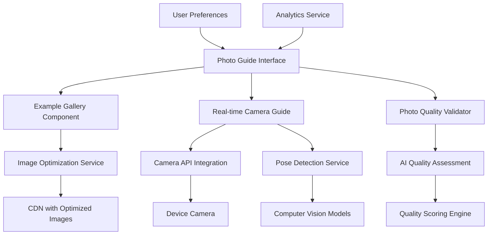

# Design Document

## Overview

The Hair Analysis Photo Guide is a comprehensive user guidance system that integrates with the existing Regrowx hair analysis feature to dramatically improve photo quality and analysis accuracy. The system combines static example galleries, real-time camera guidance, and intelligent feedback to help users capture optimal front-view photos for AI analysis.

The design emphasizes mobile-first development with progressive enhancement, ensuring excellent performance on low-bandwidth connections while providing rich interactive features on capable devices. The system integrates seamlessly with the existing hair analysis workflow while being modular enough to be reused across different parts of the application.

## Architecture

### High-Level Architecture



### Component Integration

The Photo Guide integrates with the existing hair analysis system through:
- **Pre-analysis Phase**: Guides users before they start taking photos
- **During Capture**: Provides real-time feedback during photo taking
- **Post-capture Validation**: Assesses photo quality before sending to AI analysis
- **Fallback Integration**: Connects to existing questionnaire system if photos are inadequate

## Components and Interfaces

### Core Components

#### 1. Photo Guide Container Component
```typescript
interface PhotoGuideProps {
  hairType?: string;
  analysisType: 'initial' | 'progress' | 'comparison';
  onPhotoCapture: (photo: CapturedPhoto) => void;
  onSkipGuide: () => void;
  userPreferences: UserPreferences;
}

interface CapturedPhoto {
  imageData: string;
  qualityScore: number;
  metadata: PhotoMetadata;
  timestamp: Date;
}
```

#### 2. Example Gallery Component
```typescript
interface ExampleGalleryProps {
  hairType: string;
  examples: ExamplePhoto[];
  onExampleSelect: (example: ExamplePhoto) => void;
  loading: boolean;
}

interface ExamplePhoto {
  id: string;
  imageUrl: string;
  thumbnailUrl: string;
  hairType: string;
  annotations: Annotation[];
  description: string;
  qualityIndicators: QualityIndicator[];
}

interface Annotation {
  x: number;
  y: number;
  label: string;
  description: string;
  type: 'good' | 'attention' | 'avoid';
}
```

#### 3. Real-time Camera Guide Component
```typescript
interface CameraGuideProps {
  isActive: boolean;
  onPhotoCapture: (photo: CapturedPhoto) => void;
  onQualityFeedback: (feedback: QualityFeedback) => void;
  guidanceMode: 'overlay' | 'sidebar' | 'minimal';
}

interface QualityFeedback {
  overallScore: number;
  issues: QualityIssue[];
  suggestions: string[];
  readyToCapture: boolean;
}

interface QualityIssue {
  type: 'lighting' | 'positioning' | 'focus' | 'angle' | 'hair_visibility';
  severity: 'low' | 'medium' | 'high';
  message: string;
  suggestion: string;
}
```

#### 4. Photo Quality Validator Component
```typescript
interface PhotoValidatorProps {
  photo: File | string;
  hairType: string;
  onValidation: (result: ValidationResult) => void;
  strictMode: boolean;
}

interface ValidationResult {
  isValid: boolean;
  qualityScore: number;
  issues: QualityIssue[];
  recommendations: string[];
  canProceed: boolean;
  alternativeOptions: AlternativeOption[];
}

interface AlternativeOption {
  type: 'retake' | 'questionnaire' | 'different_angle';
  label: string;
  description: string;
  action: () => void;
}
```

#### 5. Guidance Overlay Component
```typescript
interface GuidanceOverlayProps {
  isVisible: boolean;
  guidanceType: 'positioning' | 'lighting' | 'hair_arrangement';
  currentFeedback: QualityFeedback;
  onDismiss: () => void;
}
```

#### 6. Progress Indicator Component
```typescript
interface ProgressIndicatorProps {
  currentStep: number;
  totalSteps: number;
  stepLabels: string[];
  completedSteps: boolean[];
}
```

## Data Models

### Example Photo Model
```typescript
interface ExamplePhotoModel {
  id: string;
  imageUrl: string;
  thumbnailUrl: string;
  optimizedUrls: {
    webp: string;
    jpeg: string;
    avif?: string;
  };
  hairCharacteristics: {
    type: 'straight' | 'wavy' | 'curly' | 'coily';
    length: 'short' | 'medium' | 'long';
    thickness: 'fine' | 'medium' | 'thick';
    condition: 'healthy' | 'damaged' | 'thinning';
  };
  annotations: Annotation[];
  metadata: {
    uploadedAt: Date;
    approvedBy: string;
    qualityScore: number;
    usageCount: number;
  };
}
```

### User Photo Session Model
```typescript
interface PhotoSession {
  id: string;
  userId: string;
  sessionType: 'initial' | 'progress' | 'comparison';
  startedAt: Date;
  completedAt?: Date;
  photos: CapturedPhoto[];
  guidanceInteractions: GuidanceInteraction[];
  finalSelection?: string;
  qualityMetrics: SessionQualityMetrics;
}

interface GuidanceInteraction {
  timestamp: Date;
  type: 'example_viewed' | 'feedback_received' | 'retake_requested';
  data: any;
}

interface SessionQualityMetrics {
  averageQualityScore: number;
  retakeCount: number;
  guidanceViewTime: number;
  successfulCapture: boolean;
}
```

### Quality Assessment Model
```typescript
interface QualityAssessment {
  photoId: string;
  overallScore: number;
  detailedScores: {
    lighting: number;
    focus: number;
    positioning: number;
    hairVisibility: number;
    scalpVisibility: number;
  };
  detectedIssues: QualityIssue[];
  confidence: number;
  processingTime: number;
  modelVersion: string;
}
```

## Error Handling

### Camera Access Errors
- Graceful fallback to file upload if camera access is denied
- Clear messaging about camera permissions with instructions to enable
- Alternative guidance for users uploading existing photos
- Progressive enhancement for devices without camera capabilities

### Image Processing Errors
- Retry mechanisms for failed quality assessments
- Fallback to simpler validation if advanced AI processing fails
- Clear error messages with actionable next steps
- Offline capability for basic quality checks

### Network Connectivity Issues
- Cached example images for offline viewing
- Progressive loading with low-resolution previews
- Queue photo uploads for processing when connection improves
- Local storage for session data to prevent loss

### Device Compatibility
- Feature detection for camera capabilities
- Graceful degradation for older browsers
- Alternative interfaces for devices with limited processing power
- Accessibility considerations for users with disabilities

## Testing Strategy

### Unit Testing
- Component rendering with different hair types and user preferences
- Quality assessment algorithm accuracy with test image datasets
- Camera integration mocking for consistent testing
- Validation logic for various photo quality scenarios

### Integration Testing
- End-to-end photo capture workflow testing
- Integration with existing hair analysis system
- Cross-browser camera API compatibility testing
- Performance testing with various image sizes and qualities

### User Experience Testing
- Usability testing with target demographic in African markets
- A/B testing of different guidance approaches
- Accessibility testing with screen readers and assistive technologies
- Performance testing on low-end mobile devices

### Quality Assurance Testing
- Photo quality assessment accuracy validation
- False positive/negative rate analysis for quality detection
- Cultural sensitivity review for example images
- Privacy compliance testing for image handling

## Performance Optimization

### Image Optimization
- Multiple format support (WebP, AVIF, JPEG) with fallbacks
- Responsive image sizing based on device capabilities
- Lazy loading for example galleries
- Progressive JPEG encoding for faster perceived loading

### Mobile Performance
- Service worker caching for example images and guidance content
- Efficient camera stream handling to minimize battery drain
- Optimized computer vision models for real-time feedback
- Memory management for photo processing and storage

### Network Optimization
- CDN deployment with edge caching for example images
- Adaptive quality based on connection speed detection
- Compression optimization for uploaded photos
- Efficient API design to minimize data transfer

## Security and Privacy

### Image Privacy
- Client-side image processing where possible to minimize server uploads
- Automatic image deletion after analysis completion
- Encrypted transmission for all photo data
- Clear consent mechanisms for image usage and storage

### Data Protection
- GDPR compliance for European users
- Local data storage minimization
- Secure handling of biometric data (facial features in photos)
- Regular security audits for image processing pipelines

## Accessibility Considerations

### Visual Accessibility
- High contrast mode support for guidance overlays
- Screen reader compatibility for all guidance text
- Alternative text descriptions for example images
- Keyboard navigation support for all interactive elements

### Motor Accessibility
- Voice-activated photo capture options
- Adjustable timing for real-time feedback
- Large touch targets for mobile interactions
- Alternative input methods for users with limited mobility

### Cognitive Accessibility
- Simple, clear language in all guidance text
- Progressive disclosure of complex information
- Visual indicators to supplement text instructions
- Consistent interaction patterns throughout the experience

## Integration Points

### Existing Hair Analysis System
- Seamless handoff of validated photos to AI analysis
- Integration with user profile and analysis history
- Consistent styling and branding with main application
- Shared authentication and user session management

### Analytics and Monitoring
- Photo quality improvement metrics tracking
- User engagement and completion rate monitoring
- Performance metrics for real-time guidance features
- A/B testing framework integration for continuous improvement