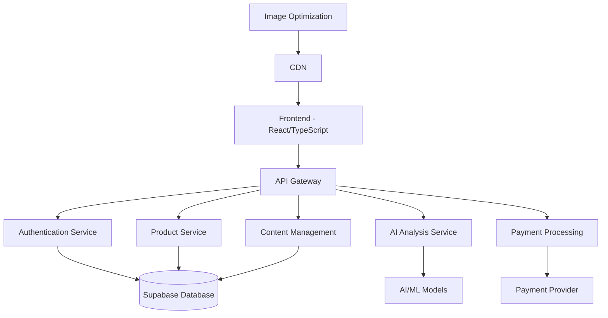

# Design Document

## Overview

The Regrowx business website is a modern, mobile-first web application that serves as the digital gateway to African herbal hair care wisdom enhanced by AI technology. The platform combines storytelling, e-commerce, AI-powered analysis, and educational content in a cohesive experience that works seamlessly across devices and network conditions.

The design prioritizes accessibility for African markets with limited bandwidth while maintaining a premium feel that builds trust and showcases the brand's unique positioning at the intersection of tradition and innovation.

## Architecture

### High-Level Architecture



### Technology Stack

**Frontend:**
- React 18 with TypeScript for type safety and modern development
- Tailwind CSS for responsive, utility-first styling
- Next.js for server-side rendering and optimal performance
- Progressive Web App (PWA) capabilities for offline functionality

**Backend:**
- Supabase for authentication, database, and real-time features
- Node.js/Express API for custom business logic
- Serverless functions for AI processing and integrations

**AI/ML:**
- TensorFlow.js for client-side hair analysis
- Custom trained models for scalp condition assessment
- Image processing libraries for ScalpScan™ technology

**Infrastructure:**
- Vercel/Netlify for frontend deployment
- CDN for global content delivery with Africa-optimized nodes
- Image optimization service for bandwidth-conscious delivery

## Components and Interfaces

### Core Components

#### 1. Header/Navigation Component
```typescript
interface NavigationProps {
  isAuthenticated: boolean;
  cartItemCount: number;
  onMenuToggle: () => void;
}
```
- Responsive navigation with mobile hamburger menu
- Cart indicator and user authentication status
- Language selector for local language support

#### 2. Hero Section Component
```typescript
interface HeroSectionProps {
  backgroundImage: string;
  title: string;
  subtitle: string;
  ctaButton: {
    text: string;
    action: () => void;
  };
}
```
- Compelling brand story presentation
- Call-to-action for hair analysis
- Optimized images with lazy loading

#### 3. Hair Analysis Component
```typescript
interface HairAnalysisProps {
  onImageUpload: (file: File) => void;
  onAnalysisComplete: (results: AnalysisResults) => void;
  isProcessing: boolean;
}

interface AnalysisResults {
  hairType: string;
  scalpCondition: string;
  recommendations: Product[];
  confidenceScore: number;
}
```
- Camera integration for mobile devices
- Progress tracking with visual feedback
- Offline capability for analysis queue

#### 4. Product Catalog Component
```typescript
interface ProductCatalogProps {
  products: Product[];
  filters: FilterOptions;
  onFilterChange: (filters: FilterOptions) => void;
  onAddToCart: (productId: string) => void;
}

interface Product {
  id: string;
  name: string;
  description: string;
  ingredients: Ingredient[];
  price: number;
  images: string[];
  traditionalUse: string;
  farmerStory: string;
}
```
- Ingredient highlighting with traditional knowledge
- Farmer stories and ethical sourcing information
- Stock status and waitlist functionality

#### 5. Educational Content Component
```typescript
interface EducationalContentProps {
  articles: Article[];
  searchQuery: string;
  onSearch: (query: string) => void;
}

interface Article {
  id: string;
  title: string;
  content: string;
  traditionalKnowledge: {
    source: string;
    attribution: string;
  };
  relatedProducts: string[];
}
```
- Search functionality for traditional remedies
- Proper attribution to knowledge keepers
- Related product recommendations

#### 6. Testimonials Component
```typescript
interface TestimonialsProps {
  testimonials: Testimonial[];
  showProgressPhotos: boolean;
}

interface Testimonial {
  id: string;
  customerName: string;
  beforeAfterPhotos: string[];
  timeframe: string;
  results: string;
  verified: boolean;
}
```
- Before/after photo galleries
- Progress tracking visualization
- Verification badges for authenticity

## Data Models

### User Model
```typescript
interface User {
  id: string;
  email: string;
  profile: {
    name: string;
    hairType?: string;
    scalpCondition?: string;
    preferences: UserPreferences;
  };
  analysisHistory: AnalysisRecord[];
  orders: Order[];
  createdAt: Date;
  updatedAt: Date;
}
```

### Product Model
```typescript
interface Product {
  id: string;
  name: string;
  description: string;
  price: number;
  currency: string;
  ingredients: Ingredient[];
  categories: string[];
  images: ProductImage[];
  inventory: {
    quantity: number;
    lowStockThreshold: number;
  };
  sourcing: {
    farmers: FarmerInfo[];
    region: string;
    harvestSeason: string;
  };
  traditionalUse: {
    description: string;
    culturalContext: string;
    attribution: string;
  };
}
```

### Analysis Model
```typescript
interface AnalysisRecord {
  id: string;
  userId: string;
  timestamp: Date;
  inputData: {
    images: string[];
    questionnaire: QuestionnaireResponse;
  };
  results: {
    hairType: string;
    scalpCondition: string;
    recommendations: ProductRecommendation[];
    confidenceScore: number;
  };
  followUpScheduled?: Date;
}
```

### Order Model
```typescript
interface Order {
  id: string;
  userId: string;
  items: OrderItem[];
  total: number;
  currency: string;
  status: OrderStatus;
  shipping: ShippingInfo;
  payment: PaymentInfo;
  createdAt: Date;
  updatedAt: Date;
}
```

## Error Handling

### Client-Side Error Handling
- Global error boundary for React components
- Graceful degradation for offline scenarios
- User-friendly error messages with recovery suggestions
- Automatic retry mechanisms for failed API calls

### Network Resilience
- Service worker for offline functionality
- Request queuing for poor connectivity
- Progressive image loading with placeholders
- Cached content for essential features

### AI Analysis Error Handling
- Fallback to questionnaire-based analysis if image processing fails
- Confidence score thresholds for result reliability
- Manual review queue for low-confidence analyses
- Clear communication about analysis limitations

## Testing Strategy

### Unit Testing
- Jest and React Testing Library for component testing
- TypeScript type checking for compile-time error prevention
- Mock services for isolated component testing
- Coverage targets: 80% for critical business logic

### Integration Testing
- API endpoint testing with realistic data
- Database integration testing with Supabase
- Payment flow testing with test payment providers
- AI model accuracy testing with validation datasets

### End-to-End Testing
- Cypress for critical user journeys
- Mobile device testing across different screen sizes
- Performance testing under various network conditions
- Accessibility testing with screen readers and keyboard navigation

### Performance Testing
- Lighthouse audits for Core Web Vitals
- Load testing for high traffic scenarios
- Image optimization validation
- Mobile performance benchmarking

### User Acceptance Testing
- Beta testing with target audience in Ghana and broader Africa
- Usability testing for hair analysis workflow
- Cultural sensitivity review for traditional knowledge presentation
- Accessibility testing with users of varying technical literacy

## Security Considerations

### Data Protection
- GDPR compliance for international users
- Secure image upload and storage
- User data encryption at rest and in transit
- Regular security audits and penetration testing

### Payment Security
- PCI DSS compliance for payment processing
- Secure tokenization of payment methods
- Fraud detection and prevention
- Regular security updates and patches

### AI Model Security
- Model versioning and rollback capabilities
- Input validation for image uploads
- Rate limiting for analysis requests
- Privacy-preserving analysis techniques

## Performance Optimization

### Mobile-First Optimization
- Critical CSS inlining for faster initial render
- Progressive image loading with WebP format
- Service worker caching for repeat visits
- Minimal JavaScript bundles with code splitting

### Network Optimization
- CDN deployment with African edge nodes
- Gzip compression for all text assets
- HTTP/2 server push for critical resources
- Adaptive image serving based on connection speed

### AI Performance
- Client-side model optimization for mobile devices
- Progressive enhancement for AI features
- Fallback mechanisms for older devices
- Efficient model loading and caching strategies